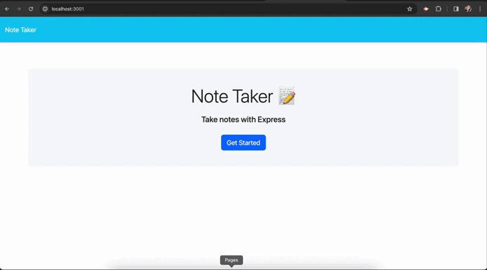

# Note-Taker

## Description

This repo was created to connect the front end with the back end of the application, using Express.js and then deployed in Horuku. The user then can enter as many notes as they wants and delete them as the user pleases.

Deployed app URL: [https://note-taker-845-d1a071143746.herokuapp.com/](https://note-taker-845-d1a071143746.herokuapp.com/)

## Table of Contents

- [Installation](#installation)
- [Usage](#usage)
- [Demo](#demo)
- [Credits](#credits)
- [License](#license)
- [How to Contribute](#how-to-contribute)

## Installation

no installation required

## Usage

To enter a new note:

1. Enter the note title
2. Enter the note text
3. Click the "save note" button
4. Saved notes will be shown on the left

To delete a note:

1. click on the note you would like to delete
2. click on the red trash icon

## Credits

npm package uuid was utilized for the back end.
Additionally, the helper functions, writeToFile, readAndAppend were taken from the class repository.

## License

This application is covered under [MIT](https://choosealicense.com/licenses/mit/) license

## How to Contribute

If you have any questions, comments, or concerns please feel free to reach me at beatz.bravo@gmail.com. If you would like to contribute to my project, you can find my repo on [github.com/Beabravo](https://www.github.com/Beabravo)
